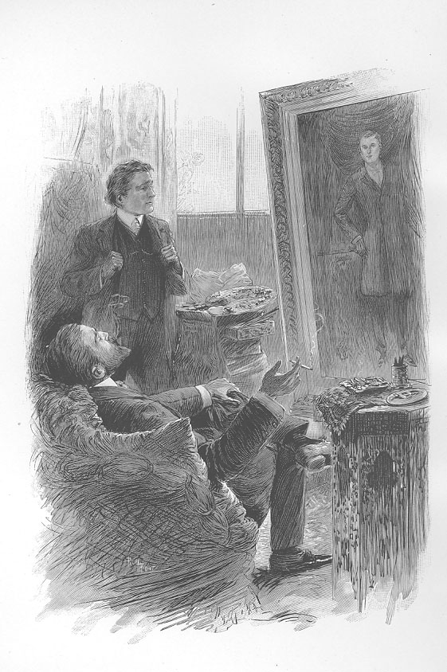

# The Picture of Dorian Gray
## by Oscar Wilde

## THE PREFACE

The artist is the creator of beautiful things.  To reveal art and
conceal the artist is art's aim.  The critic is he who can translate
into another manner or a new material his impression of beautiful
things.

The highest as the lowest form of criticism is a mode of autobiography.
Those who find ugly meanings in beautiful things are corrupt without
being charming.  This is a fault.

Those who find beautiful meanings in beautiful things are the
cultivated.  For these there is hope.  They are the elect to whom
beautiful things mean only beauty.

There is no such thing as a moral or an immoral book.  Books are well
written, or badly written.  That is all.

The nineteenth century dislike of realism is the rage of Caliban seeing
his own face in a glass.

The nineteenth century dislike of romanticism is the rage of Caliban
not seeing his own face in a glass.  The moral life of man forms part
of the subject-matter of the artist, but the morality of art consists
in the perfect use of an imperfect medium.  No artist desires to prove
anything.  Even things that are true can be proved.  No artist has
ethical sympathies.  An ethical sympathy in an artist is an
unpardonable mannerism of style.  No artist is ever morbid.  The artist
can express everything.  Thought and language are to the artist
instruments of an art.  Vice and virtue are to the artist materials for
an art.  From the point of view of form, the type of all the arts is
the art of the musician.  From the point of view of feeling, the
actor's craft is the type.  All art is at once surface and symbol.
Those who go beneath the surface do so at their peril.  Those who read
the symbol do so at their peril.  It is the spectator, and not life,
that art really mirrors.  Diversity of opinion about a work of art
shows that the work is new, complex, and vital.  When critics disagree,
the artist is in accord with himself.  We can forgive a man for making
a useful thing as long as he does not admire it.  The only excuse for
making a useless thing is that one admires it intensely.

>               All art is quite useless.
>                            OSCAR WILDE

[Read the book](https://www.gutenberg.org/cache/epub/174/pg174.txt)